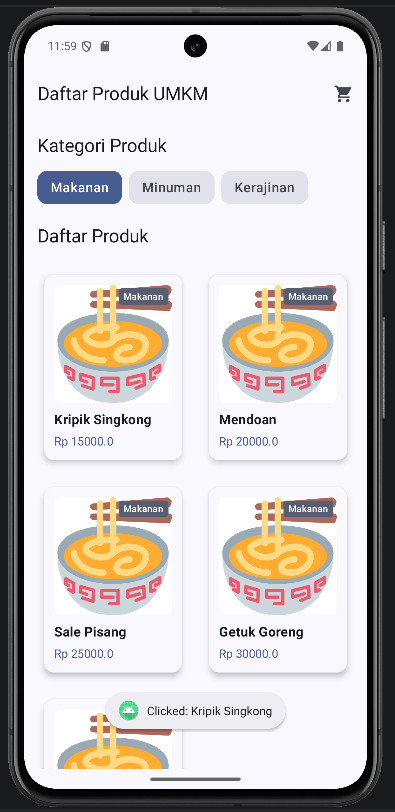
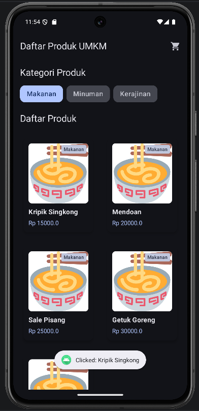
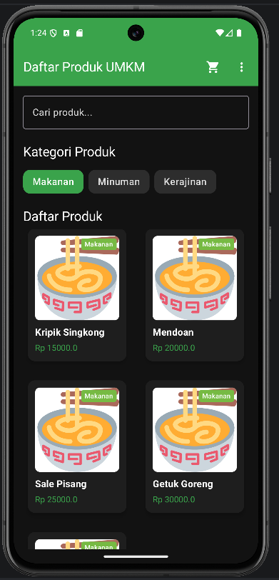
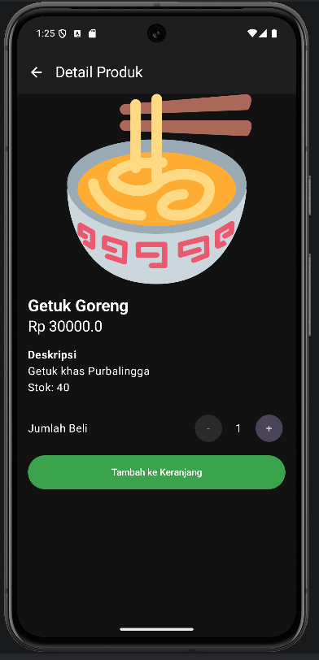
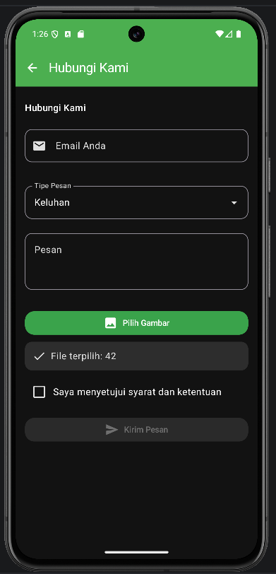

# Laporan Praktikum Pemrograman Mobile

**Nama**        : Ahmad Fikri Zakaria  
**NIM**         : H1D024062  
**Shift**       : Awal B / Akhir C  
**Praktikum**   : Pemrograman Mobile

Materi PDF tersedia di folder [`docs/pdf`](docs/pdf/).

---

## 📝 Tugas Pertemuan 1
**Tanggal**: Selasa, 1 September 2026

**Kesimpulan Praktikum:**  
Pada pertemuan pertama, saya membuat halaman pengenalan untuk aplikasi Jualan dengan Jetpack Compose. Materi ini membantu saya memahami penyusunan elemen tampilan, mulai dari logo, judul, deskripsi aplikasi, informasi misi, hingga tombol untuk berpindah ke halaman berikutnya.

---

## 📝 Tugas Pertemuan 2
**Tanggal**: Selasa, 8 September 2026

**Kesimpulan Praktikum:**  
Pada pertemuan kedua, saya menambahkan halaman Hubungi Kami sebagai sarana pengguna mengirimkan masukan. Saya belajar membuat kolom email dan pesan, menambahkan tombol Kirim Pesan, serta mengatur perpindahan halaman dan notifikasi setelah formulir dikirim.

---

## 📝 Tugas Pertemuan 3
**Tanggal**: Selasa, 15 September 2026

**Kesimpulan Praktikum:**  
Pada pertemuan ketiga, saya mempelajari cara menampilkan data produk secara dinamis menggunakan data class, dummy data, `LazyRow`, dan `LazyVerticalGrid`. Aplikasi juga dilengkapi pilihan kategori sehingga daftar produk dapat disaring, sementara setiap kartu produk memberikan respons Toast ketika dipilih.

---

## 📝 Tugas Pertemuan 4
**Tanggal**: Selasa, 22 September 2026

**Kesimpulan Praktikum:**
Pada pertemuan keempat, saya menerapkan state hoisting dan recomposition pada form Hubungi Kami. Form tersebut memiliki validasi email dan pesan, pilihan tipe pesan, checkbox persetujuan, pemilihan gambar, serta notifikasi ketika data dikirim. Saya juga menambahkan proses loading pada daftar produk, pencarian, filter kategori, menu navigasi, dan halaman detail produk. Materi ini membantu saya memahami pembagian tanggung jawab state serta alur navigasi antarlayar pada aplikasi Compose.
