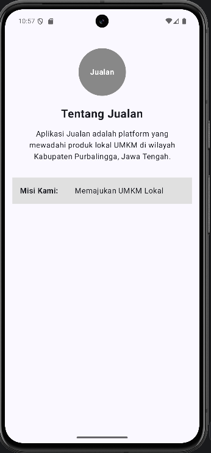
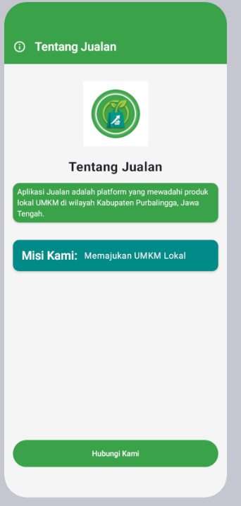
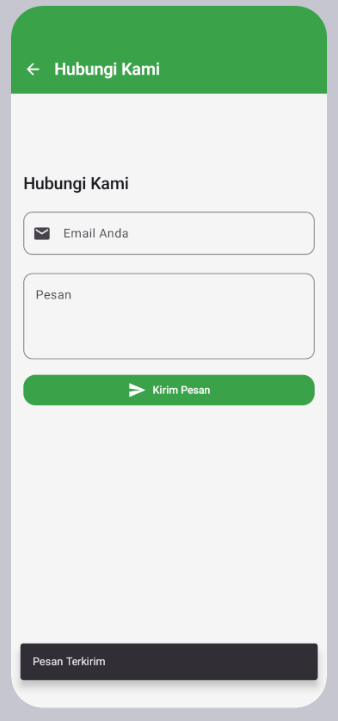

# Laporan Praktikum Pemrograman Mobile

**Nama**        : Ahmad Fikri Zakaria  
**NIM**         : H1D024062  
**Shift**       : Awal B / Akhir C  
**Praktikum**   : Pemrograman Mobile

---

## 📝 Tugas Pertemuan 1
**Tanggal**: Selasa, 1 September 2026

**Kesimpulan Praktikum:**  
Pada pertemuan pertama, saya membuat halaman pengenalan untuk aplikasi Jualan dengan Jetpack Compose. Materi ini membantu saya memahami penyusunan elemen tampilan, mulai dari logo, judul, deskripsi aplikasi, informasi misi, hingga tombol untuk berpindah ke halaman berikutnya.

---

## 📝 Tugas Pertemuan 2
**Tanggal**: Selasa, 8 September 2026

**Kesimpulan Praktikum:**  
Pada pertemuan kedua, saya menambahkan halaman Hubungi Kami sebagai sarana pengguna mengirimkan masukan. Saya belajar membuat kolom email dan pesan, menambahkan tombol Kirim Pesan, serta mengatur perpindahan halaman dan notifikasi setelah formulir dikirim.
